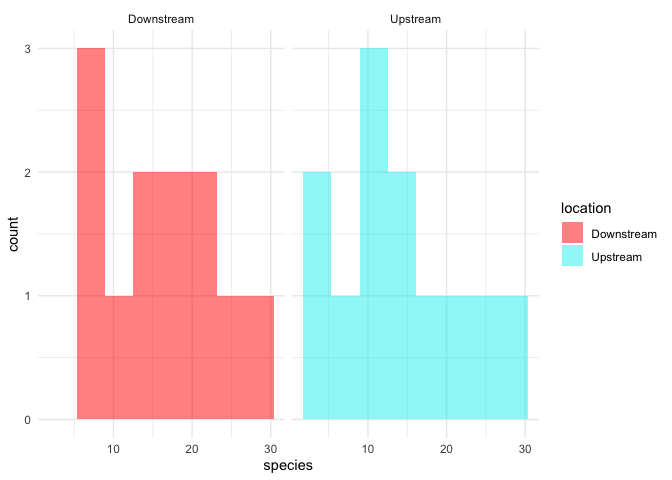
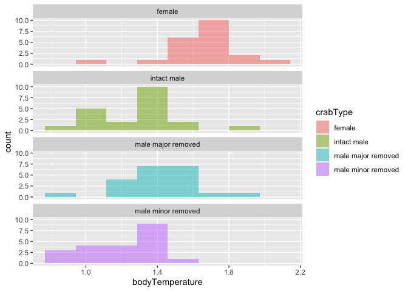

Lab 6 Comparing means
================
Lukas Robinson
2021-04-27

Fill out this report and submit it as your completed assignment.

You can view the R markdown script that created this report here:
[README.Rmd](README.Rmd)

## *t*-test

Researchers studying the number of electric fish species living in
various parts of the Amazon basin were interested in whether the
presence of tributaries affected the local number of electric fish
species in the main rivers (Fernandes et al. 2004).

They counted the number of electric fish species above and below the
entrance point of a major tributary at 12 different river locations.

The data is provided in your GitHub repository.

For each question below, write a sentence answering the question and
show the code you used to come up with the answer, if applicable.

load packages & read data sets

``` r
library(tidyverse)
```

    ## ── Attaching packages ─────────────────────────────────────── tidyverse 1.3.0 ──

    ## ✓ ggplot2 3.3.3     ✓ purrr   0.3.4
    ## ✓ tibble  3.0.4     ✓ dplyr   1.0.2
    ## ✓ tidyr   1.1.2     ✓ stringr 1.4.0
    ## ✓ readr   1.4.0     ✓ forcats 0.5.0

    ## ── Conflicts ────────────────────────────────────────── tidyverse_conflicts() ──
    ## x dplyr::filter() masks stats::filter()
    ## x dplyr::lag()    masks stats::lag()

``` r
fish <- read_csv("chap12q19ElectricFish.csv")
```

    ## 
    ## ── Column specification ────────────────────────────────────────────────────────
    ## cols(
    ##   tributary = col_character(),
    ##   speciesUpstream = col_double(),
    ##   speciesDownstream = col_double()
    ## )

``` r
crabs <- read_csv("chap15q27FiddlerCrabFans.csv")
```

    ## 
    ## ── Column specification ────────────────────────────────────────────────────────
    ## cols(
    ##   crabType = col_character(),
    ##   bodyTemperature = col_double()
    ## )

``` r
fish_long <- 
  pivot_longer(fish, speciesUpstream:speciesDownstream,
               names_to = "location",
               values_to = "species") %>% 
  mutate(location = str_remove(location, c("species")))
```

### Question A

> Test the hypothesis that the tributaries have no effect on the number
> of species of electric fish.

``` r
t.test(formula = species ~ location, data = fish_long)
```

    ## 
    ##  Welch Two Sample t-test
    ## 
    ## data:  species by location
    ## t = 0.59249, df = 21.81, p-value = 0.5596
    ## alternative hypothesis: true difference in means is not equal to 0
    ## 95 percent confidence interval:
    ##  -4.587031  8.253697
    ## sample estimates:
    ## mean in group Downstream   mean in group Upstream 
    ##                 16.41667                 14.58333

The p-value is greater than 0.5 so we are accepting the null hypothesis.

### Question B

> What is the difference in the mean numbers of species between areas
> upstream and downstream of a tributary? What is the 95% confidence
> interval of this difference in means?

The mean difference is 1.83334 and the 95% confidence interval of this
difference in means is -4.587031 and 8.253697.

### Question C

> State the assumptions that you had to make to complete parts (A) and
> (B). Create a graph to assess whether one of those assumptions was
> met.

The assumptions of a t-test is the sampling units are randomly sampled
from populations and the paired differences have a normal distribution
in populations. The paired differences can be tested by creating a
histogram of the two populations. This histogram then shows that the
data does have characteristics of a normal distribution in the sample
size fo 12 samples per location.

``` r
fish_long %>% 
  ggplot(aes(x = species)) +
  geom_histogram(
    aes(fill = location),
    bins = 8,
    alpha = 0.5,
    position = "identity"
  ) +
  scale_fill_manual(values = c("red", "cyan2")) +
  theme_minimal() +
  facet_wrap( ~ location)
```

<!-- -->

## ANOVA

Fiddler crabs are so called because males have a greatly enlarged
“major” claw, which is used to attract females and to defend a burrow.

Darnell and Munguia (2011) recently suggested that this appendage might
also act as a heat sink, keeping males cooler while out of the burrow on
hot days.

To test this, they placed four groups of crabs into separate plastic
cups and supplied a source of radiant heat (60-watt light bulb) from
above. The four groups were intact male crabs, male crabs with the major
claw removed; male crabs with the other (minor) claw removed (control);
and intact female fiddler crabs.

They measured the body temperature of crabs every 10 minutes for 1.5
hours. These measurements were used to calculate a rate of heat gain for
every individual crab in degrees C/log minute. Rates of heat gain for
all crabs are provided in the accompanying data file.

### Question D

> Graph the distribution of body temperatures for each crab type:

``` r
crabs %>% 
  filter(!is.na(crabType)) %>% 
  ggplot(aes(x = bodyTemperature)) +
  geom_histogram(
    aes(fill = crabType),
    bins = 8,
    alpha = 0.5,
    position = "identity"
  ) +
  facet_wrap( ~ crabType, ncol = 1)
```

<!-- -->

### Question E

> Does body temperature vary among crab types? State the null and
> alternative hypothesis, conduct and ANOVA, and interpret the results.
>
> HO: The body temperature is equal among all crab types
>
> HA: At least one crab type is different from the others

``` r
aov_crab <-
  aov(bodyTemperature ~ crabType, data = crabs)

summary(aov_crab)
```

    ##             Df Sum Sq Mean Sq F value Pr(>F)    
    ## crabType     3  2.641  0.8804   20.31  7e-10 ***
    ## Residuals   80  3.468  0.0433                   
    ## ---
    ## Signif. codes:  0 '***' 0.001 '**' 0.01 '*' 0.05 '.' 0.1 ' ' 1
    ## 1 observation deleted due to missingness

The ANOVA results that the F value is greater than one and this means we
are going to support the alternative hypothesis. The p-value is less
than 0.5 which means we are rejecting the null hypothesis meaning there
is at least one crab type different from the others.
